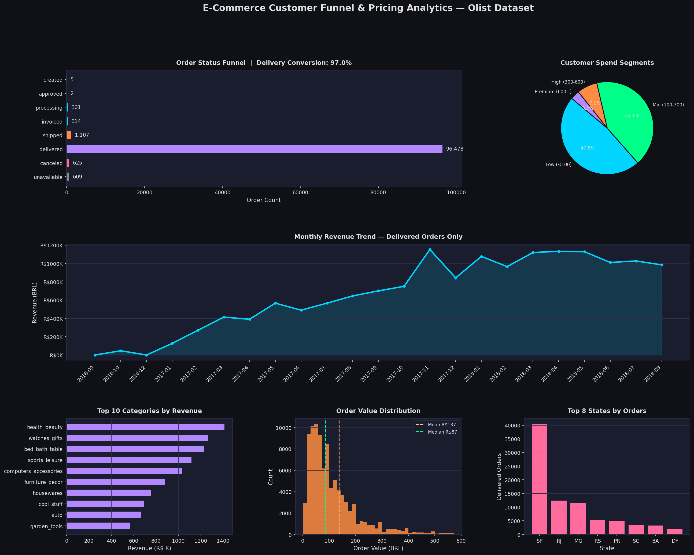

# E-Commerce Customer Funnel & Pricing Analytics

End-to-end analytics pipeline on **99,441 real orders** from the Brazilian Olist e-commerce dataset (Kaggle).  
Covers order funnel conversion, category-level revenue, customer spend segmentation, and 23-month revenue trends.



---

## Key Findings

| Metric | Value |
|---|---|
| Total Orders Analyzed | 99,441 |
| Delivery Conversion Rate | **97.0%** |
| Cancellation Rate | 0.6% |
| Avg Order Value | R$137.04 |
| Median Order Value | R$86.57 |
| Top Revenue Category | health_beauty (R$1.41M, 8,613 orders) |
| Premium Customers (>R$600 LTV) | 3,079 |
| Top State by Orders | SP — 40,501 orders (40% share) |
| Revenue Growth (Jan 2017 → Jan 2018) | ~8x YoY |
| Nov 2017 Peak Revenue | R$1.15M |

---

## Dashboard Panels

| Panel | What it shows |
|---|---|
| Order Status Funnel | Volume at each stage; 97% delivery conversion |
| Customer Spend Segments | Low / Mid / High / Premium tier distribution |
| Monthly Revenue Trend | 23-month trend with Nov 2017 peak annotated |
| Top 10 Categories | Revenue ranking across product categories |
| Order Value Distribution | Histogram with mean (R$137) and median (R$87) lines |
| Top 8 States | Regional demand concentration |

---

## Dataset

**Source:** [Brazilian E-Commerce Public Dataset by Olist](https://www.kaggle.com/datasets/olistbr/brazilian-ecommerce) — Kaggle  

Files used:
- `olist_orders_dataset.csv`
- `olist_order_items_dataset.csv`
- `olist_order_reviews_dataset.csv`
- `olist_products_dataset.csv`
- `product_category_name_translation.csv`
- `olist_customers_dataset.csv`

> CSVs are not included in this repository (see `.gitignore`).  
> Download from Kaggle and place in the project root folder before running.

---

## Project Structure

```
ecommerce-funnel-analytics/
├── data/                        # Place downloaded CSVs here
├── outputs/
│   ├── dashboard.png            # 6-panel analytics dashboard
│   └── analysis_results.json   # Key metrics in JSON format
├── analysis.py                  # Main analytics + dashboard script
├── requirements.txt
├── .gitignore
└── LICENSE
```

---

## Setup & Usage

**1. Clone the repo**
```bash
git clone https://github.com/aditya5ingh7019/ecommerce-funnel-analytics.git
cd ecommerce-funnel-analytics
```

**2. Install dependencies**
```bash
pip install -r requirements.txt
```

**3. Add the dataset**  
Download the Olist dataset from Kaggle and place all CSV files in the project root (same folder as `analysis.py`).

**4. Update the path in `analysis.py`**
```python
DATA_PATH = r"C:\Users\YourName\ecommerce-funnel-analytics"  # Windows
# DATA_PATH = "/home/yourname/ecommerce-funnel-analytics"    # Linux/Mac
```

**5. Run**
```bash
python analysis.py
```

Outputs are saved to the `outputs/` folder.

---

## Tech Stack

| Tool | Purpose |
|---|---|
| Python 3.10+ | Core language |
| Pandas | Data loading, merging, aggregation |
| NumPy | Numerical operations |
| Matplotlib | Dashboard visualisation |
| JSON | Structured output export |

---

## Author

**Aditya Singh**  
M.Sc. Applied Physics — Amity University Lucknow  
[GitHub](https://github.com/aditya5ingh7019) · [LinkedIn](https://www.linkedin.com/in/aditya-singh-3700b02a7/)

---

## License

MIT License — see [LICENSE](LICENSE)
